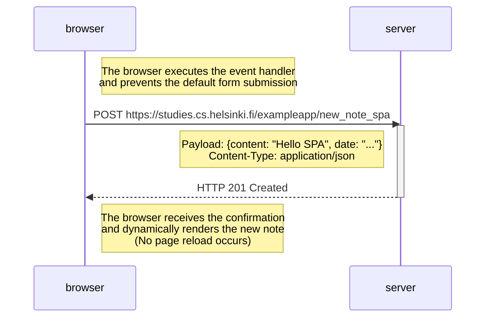

```mermaid
sequenceDiagram
    participant browser
    participant server

    Note right of browser: The browser executes the event handler<br/>and prevents the default form submission

    browser->>server: POST https://studies.cs.helsinki.fi/exampleapp/new_note_spa
    activate server
    Note left of server: Payload: {content: "Hello SPA", date: "..."}<br/>Content-Type: application/json
    server-->>browser: HTTP 201 Created
    deactivate server

    Note right of browser: The browser receives the confirmation<br/>and dynamically renders the new note<br/>(No page reload occurs)
```